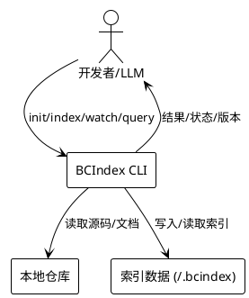
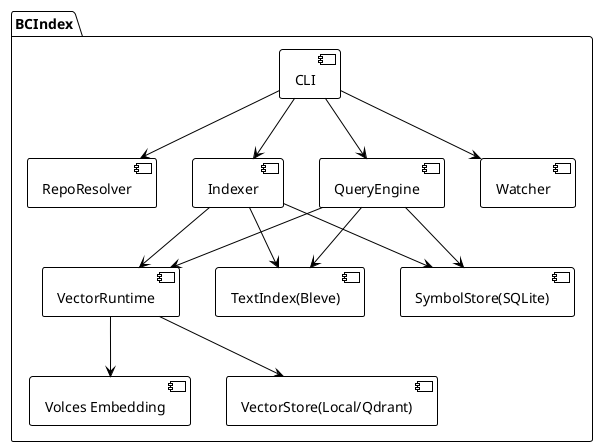
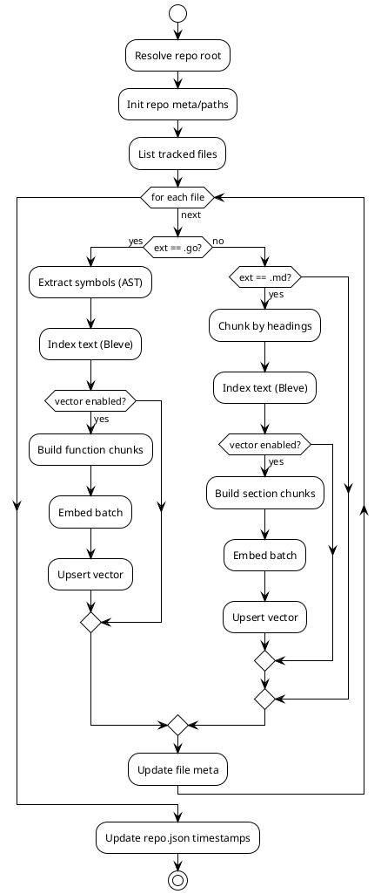
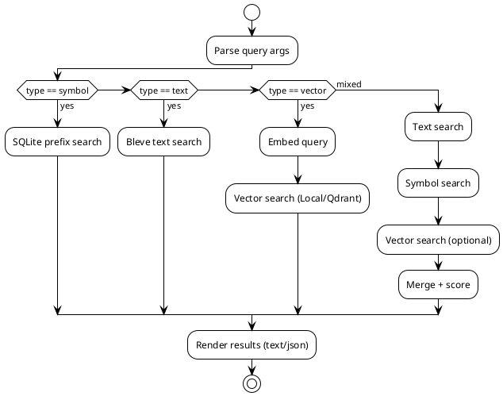

# BCIndex 本地索引与检索技术方案（基于现有实现）

> 说明：本文档基于当前代码实现（`internal/bcindex`）整理，描述已落地的能力与参数策略。

## 1. 背景

- 代码仓库规模增大后，grep/正则检索效率低，缺少结构化上下文。
- LLM 场景需要“语义相关 + 精确定位”的组合结果，单一检索方式难以满足。
- 团队需要一个**本地可落地、成本可控、对外可集成**的索引与检索能力。

## 2. 痛点

- **路径/符号记忆成本高**：不知道函数名、包路径时难以定位。
- **仅关键词检索召回不足**：同义词、缩写、业务术语不一致导致漏召回。
- **上下文组织困难**：缺少分块与结构化信息，LLM 需要人工拼接上下文。
- **增量更新缺口**：仓库频繁变更时，重建索引成本高、延迟大。

## 3. 目标

- 同时支持 **符号检索 + 文本检索 + 向量语义检索**。
- 面向本地开发者与 LLM 工具链：CLI 可直接用，后续可接 MCP/Skill。
- 支持**全量/增量/监听**索引，索引存储在用户目录。
- 参数可配置、默认开箱即用，并给出清晰的参数理由。

## 4. 解决方案概述

BCIndex 将仓库解析为三类索引：

- **符号索引（SQLite）**：函数/方法/类型等结构化信息，保证精确匹配。
- **文本索引（Bleve）**：全文与标题检索，支持路径/标题/正文的不同权重。
- **向量索引（Local SQLite 或 Qdrant + Volces Embedding）**：语义召回。

索引时：
1) 读取 Git tracked 文件（或 fallback walk），只处理 `.go` 与 Markdown。  
2) Go 使用 AST 提取符号，文本按文件/标题块入库，向量按函数/标题分块。  
3) 向量化批量调用 Volces embedding，写入向量库。  

查询时：
1) text/symbol/vector 各自召回。  
2) mixed 模式融合排序：**符号优先、文本其次、向量补全**。  

## 5. 业务架构

- **角色**：开发者、LLM 工具（CLI/后续 MCP）。
- **流程**：初始化 -> 索引 -> 查询 -> 输出结果/上下文。



## 6. 技术架构

技术组件对应代码模块如下：

- CLI 入口：`cmd/bcindex/main.go` + `internal/bcindex/cli.go`
- Repo 解析与路径管理：`repo.go` / `paths.go`
- 索引器：`indexer.go`
- 文本索引：`text_index.go`（Bleve）
- 符号存储：`symbol_store.go`（SQLite）
- 向量运行时：`vector_runtime.go` + `volces_embeddings.go`
- 向量存储：`vector_store.go`（Local SQLite 或 Qdrant）
- 查询引擎：`query.go`
- 增量与监听：`diff.go` + `cli.go` watch



## 7. 数据与存储设计

### 7.1 目录结构

索引数据统一落在用户目录：

```
~/.bcindex/
  repos/<repo_id>/
    text/      # Bleve 文本索引
    symbol/    # SQLite symbols.db
    meta/      # repo.json
  config/
    bcindex.yaml
```

### 7.2 符号与文本数据

- 符号表（`symbols`）：函数/方法/类型/变量/常量（AST 解析）。
- 文件表（`files`）：`path/hash/lang/size/mtime` 用于变更跟踪。
- 文本表（Bleve）：`path/kind/title/content/line_start/line_end`。

### 7.3 向量数据

- 向量 chunk 由函数/方法或 Markdown 标题块生成。
- 向量 ID：`vec:<file>:<hash>`，hash 来自 `file + name/title + text`。
- payload 字段：`repo_id/path/kind/name/title/line_start/line_end/hash/updated_at`。

## 8. 索引流程

### 8.1 全量索引（`bcindex index --full`）

1) 解析根目录并初始化 repo meta。  
2) 清理并重建 text/symbol 索引目录。  
3) 读取 Git tracked 文件，过滤 `.go/.md/.markdown`。  
4) `.go`：AST 抽取符号 -> 写入 SQLite；整文件写入 Bleve。  
5) `.md`：按标题层级切分 -> 分块写入 Bleve。  
6) 若启用向量：  
   - Go 按函数/方法 chunk，Markdown 按标题 chunk。  
   - 批量调用 embedding，写入向量库。  
7) 更新 `repo.json` 的 `LastIndexAt/UpdatedAt`。

### 8.2 增量索引（`bcindex index --diff <rev>`）

- 通过 `git diff --name-status` 解析变更列表。  
- 对变更文件：先删除旧索引（text/symbol/vector），再写入新索引。  
- 删除/重命名时同步清理向量映射与文本映射。  

### 8.3 监听模式（`bcindex watch`）

- 轮询 `git status --porcelain`。  
- 去抖：默认 `debounce=2s`，若小于 `interval=3s` 会被抬升。  
- 批量变更触发增量索引，减少频繁重建成本。  

## 9. 查询流程

### 9.1 text

- Bleve 多字段检索：`content/path/title`。  
- 权重策略：`path=1.5`、`title=2.0`、`content=1.0`，兼顾精确定位。  

### 9.2 symbol

- SQLite 前缀搜索：`name LIKE query%`。  
- 精确匹配优先，其次按长度/字母排序。  

### 9.3 vector

- 调用 Volces embedding，将 query 转向量。  
- Local 模式：加载 repo 内向量并做 cosine 计算。  
- Qdrant 模式：远程检索，使用 `Cosine` 距离。  

### 9.4 mixed

融合策略（`query.go`）：

```
final_score = 0.5 * vector_score
            + 0.3 * text_score
            + 0.2 * symbol_boost
```

- 同一 `(file,line)` 合并去重。  
- 优先级：symbol > text > vector。  
- 目的：**精确结果排前，语义结果补全**。  

## 10. 组件必要性说明

| 组件 | 位置 | 作用 | 为什么需要 |
| --- | --- | --- | --- |
| CLI | `cmd/bcindex`/`cli.go` | 统一入口 | 提供标准化操作与自动化集成能力 |
| RepoResolver | `repo.go`/`paths.go` | repo_id 与路径管理 | 保证索引隔离、可复用、易多仓管理 |
| Indexer | `indexer.go` | 建索引主流程 | 统一文本/符号/向量处理与错误收敛 |
| TextIndex | `text_index.go` | 全文检索 | 解决路径/文本定位问题 |
| SymbolStore | `symbol_store.go` | 结构化符号检索 | 支撑精确 API/类型定位 |
| VectorRuntime | `vector_runtime.go` | 语义检索入口 | 支撑自然语言召回 |
| VectorStore | `vector_store.go` | 向量存储 | 可选本地或 Qdrant，适配不同规模 |
| QueryEngine | `query.go` | 结果融合 | 兼顾准确性与召回率 |
| Diff/Watch | `diff.go`/`cli.go` | 增量索引 | 降低频繁重建成本 |

## 11. 参数设置与原因

### 11.1 向量配置（`~/.bcindex/config/bcindex.yaml`）

| 参数 | 默认值 | 说明与理由 |
| --- | --- | --- |
| `qdrant_url` | `http://127.0.0.1:6333` | 远程 Qdrant 服务地址，默认本地。 |
| `qdrant_path` | `~/.bcindex/qdrant` | 非空时启用**本地向量 SQLite**，降低部署成本。 |
| `qdrant_collection` | `bcindex_vectors` | 单 collection + `repo_id` 过滤，便于多仓。 |
| `qdrant_http_port` | `6333` | Qdrant 默认端口，遵循社区惯例。 |
| `qdrant_grpc_port` | `6334` | Qdrant 默认 gRPC 端口。 |
| `qdrant_auto_start` | `true` | 预留的本地 Qdrant 自动启动开关（默认本地 SQLite 模式不依赖该能力）。 |
| `volces_endpoint` | `https://ark.cn-beijing.volces.com/api/v3/embeddings/multimodal` | 默认 Volces embedding 入口。 |
| `volces_api_key` | 必填 | 访问鉴权必需。 |
| `volces_model` | 必填 | 向量模型必需。 |
| `volces_dimensions` | `1024` | 成本/存储/效果折中。 |
| `volces_encoding` | `float` | 与向量库兼容，避免额外解码成本。 |
| `volces_timeout` | `30s` | 防止网络/接口异常阻塞。 |
| `vector_enabled` | `true` | 默认启用语义检索能力。 |
| `vector_batch_size` | `8` | 兼顾吞吐与限流风险。 |
| `vector_max_chars` | `1500` | 限制 chunk 长度，控制 embedding 成本与噪声。 |
| `vector_workers` | `min(8, CPU)` | 并行嵌入，避免过度占用资源。 |

### 11.2 CLI 运行参数

- `watch --interval` 默认 `3s`：避免过于频繁轮询。  
- `watch --debounce` 默认 `2s`：批量合并变更，若小于 interval 自动抬升。  
- `query --top` 默认 `10`：结果条数平衡可读性与召回。  
- `query --type` 默认 `mixed`：面向 LLM 的综合效果最好。  

### 11.3 关键权重与阈值

- Text 查询 boost：`path=1.5`、`title=2.0`，偏向结构化字段。  
- Mixed 融合权重：`0.5/0.3/0.2`，体现语义补全、精确优先策略。  

## 12. 组件流程图（PlantUML）

### 12.1 索引流程图



### 12.2 查询流程图



## 13. 边界与约束

- 仅索引 `.go/.md/.markdown` 文件。  
- Local 向量检索为全量扫描 + cosine，适合中小规模；大规模建议用 Qdrant。  
- 向量能力依赖 Volces API Key/模型配置。  

## 14. 迭代方向（可选）

- 增强 Go AST 级别的结构化索引（类型/接口/字段等更细粒度）。  
- 支持更多文件类型与分块策略（例如 proto/sql）。  
- MCP/Skill 接口统一输出结构化查询结果。  
